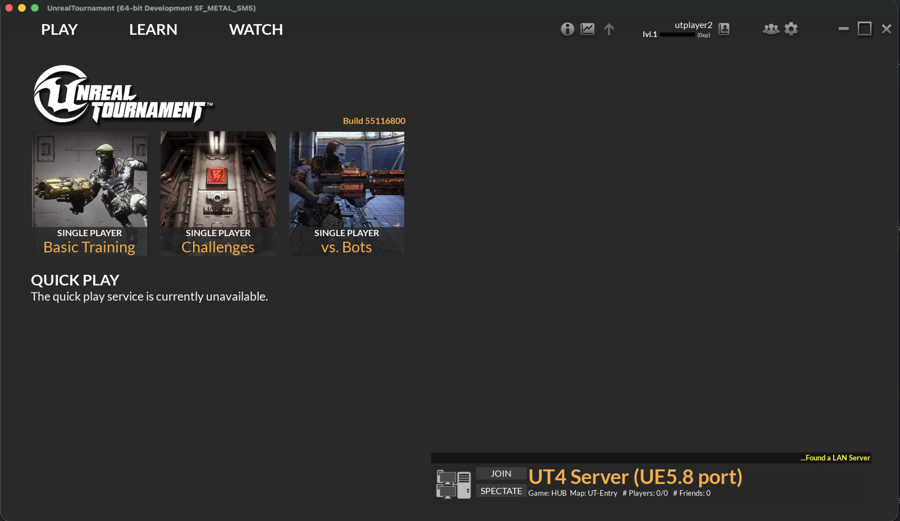
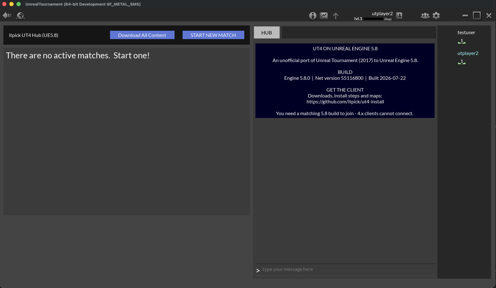
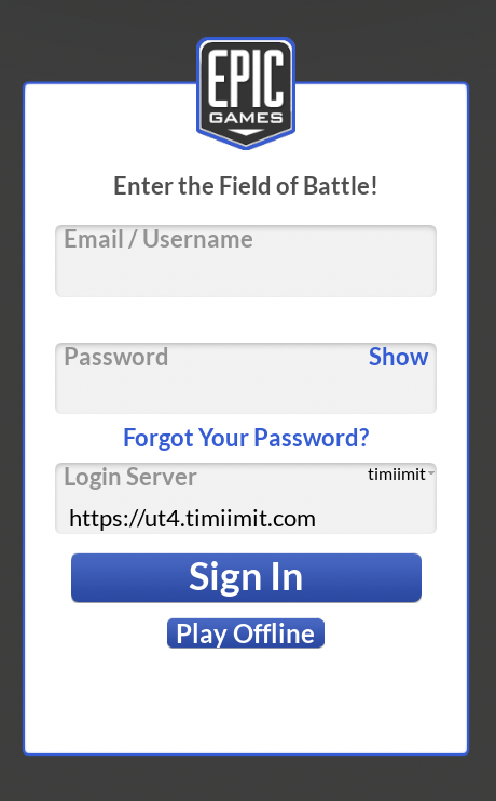

# UT4 on Unreal Engine 5.8 — install guide

Unofficial port of **Unreal Tournament (2017)** from Unreal Engine 4.15 to **Unreal Engine 5.8**.

| | |
|---|---|
| Engine | Unreal Engine 5.8.0 |
| Build | `55116800` |
| Built | 2026-07-22 |
| Platforms | Linux ✅ · macOS (Apple Silicon) ✅ · Windows 🚧 |

Client builds are published as OCI artifacts on **GitHub Container Registry** (no per-file
size limit), and individual maps are published as downloadable paks on the
[Releases](https://github.com/itpick/ut4-install/releases) page. Source lives in
[itpick/UnrealTournament](https://github.com/itpick/UnrealTournament) on the `ue5.8-port`
branch; the engine fork is [itpick/UnrealEngine](https://github.com/itpick/UnrealEngine).

---

## Screenshots

| Main menu | Hub |
|---|---|
|  |  |

<p align="center"></p>

---

## Downloads

| Artifact | Download size | Location |
|---|---|---|
| Linux client | 8.6 GB (≈16 GB extracted) | [`ghcr.io/itpick/ut4-install:linux-5.8`](https://github.com/itpick/ut4-install/pkgs/container/ut4-install) |
| macOS client (Apple Silicon) | 14 GB (≈16 GB extracted) | [`ghcr.io/itpick/ut4-install:mac-5.8`](https://github.com/itpick/ut4-install/pkgs/container/ut4-install) |
| Per-map paks (Linux) | ~2.3 GB total (40 maps) | [Release `maps-linux-v1`](https://github.com/itpick/ut4-install/releases/tag/maps-linux-v1) |

The client artifacts are pulled with [`oras`](https://oras.land) (a small CLI for OCI
registries). Each is a single zstd-compressed tarball of the staged build.

```bash
# one-time: install oras — https://oras.land/docs/installation
oras pull ghcr.io/itpick/ut4-install:linux-5.8      # or :mac-5.8
```

---

## Important: you cannot mix versions

A UE5.8 client can only join a UE5.8 server, and a 4.x client can only join a 4.x server.
The engine network protocol and map serialization both changed, so the two populations are
mutually unreachable by design — servers advertise their network version and clients filter
on it.

Maps are also **cooked per platform**. The lighting bake is shared, but Linux, macOS and
Windows each need their own pak set. A single universal map pak is not possible — this is
why the map release is platform-tagged (`-LinuxNoEditor.pak`).

---

## Requirements

- A 64-bit machine with a GPU supporting **Vulkan** (Linux), **Metal** (macOS) or **D3D12** (Windows)
- ~16 GB free disk for the client
- `oras` on your PATH to download the client
- An account on the master server you intend to play on

---

## Linux

```bash
oras pull ghcr.io/itpick/ut4-install:linux-5.8
tar -I zstd -xf ut4-client-linux.tar.zst
cd LinuxNoEditor
./UnrealTournament.sh
```

If you get a black screen or a hang on startup, try forcing single-threaded rendering:

```bash
./UnrealTournament.sh -onethread
```

Some Mesa/RADV driver combinations deadlock in the Vulkan RHI without it.

---

## macOS (Apple Silicon)

```bash
oras pull ghcr.io/itpick/ut4-install:mac-5.8
tar -I zstd -xf ut4-client-mac.tar.zst
xattr -dr com.apple.quarantine UnrealTournament.app   # clears the download quarantine
open UnrealTournament.app
```

### Grant Local Network access — required for LAN play

From **macOS 15 onward**, macOS blocks apps from reaching other machines on your network
until you approve it. On first launch you should get a prompt; approve it.

If you miss the prompt, enable it manually:

**System Settings → Privacy & Security → Local Network → Unreal Tournament**

Without this permission the symptoms are confusing rather than obvious:

- Login to a master server on your LAN fails instantly with *"The Internet connection appears to be offline"*
- Servers appear in the browser but never respond to pings, so hubs look empty
- Joining a game silently times out

A master server reached over the public internet works without it; only LAN addresses are gated.

> **Launch it with `open`, not by running the binary directly.** A direct launch bypasses the
> app sandbox and its entitlements, which breaks networking and login.

---

## Windows

Not yet available. This section lands with the first Windows build.

---

## Downloadable maps

The client ships with the full stock map set baked in, so you do not need to download
anything to play the standard rotation. Hubs can also advertise **extra** maps the client
does not have; when you join, the client fetches the map's pak over HTTPS, verifies its MD5,
mounts it and loads in — no manual install.

The per-map paks are hosted on the [`maps-linux-v1`](https://github.com/itpick/ut4-install/releases/tag/maps-linux-v1)
release. To advertise one from your own hub, add a redirect (the MD5 is the release asset's
checksum):

```ini
[OnlineSubsystemUT]
+RedirectReferences=(PackageName="DM-Chill",PackageURLProtocol="https",PackageURL="https://github.com/itpick/ut4-install/releases/download/maps-linux-v1/DM-Chill-LinuxNoEditor.pak",PackageChecksum="<md5>")
```

Because paks are per platform, a mixed Linux/macOS lobby needs both a `-LinuxNoEditor.pak`
and a `-MacNoEditor.pak` redirect for any downloadable map; each client picks the one for
its platform.

---

## Signing in

The game needs a master server for login and the server browser.

1. Launch the game
2. On the login screen, set **Login Server** to the master server URL, e.g. `https://ut4.example.com`
3. Enter your username and password, then **Sign In**

**Play Offline** skips login entirely and works for single-player and bot matches.

---

## Joining a game

**Hubs** host multiple matches; you join the hub, then join or start a match inside it.
**Servers** are a single ongoing match you join directly.

`PLAY → Join a Hub` lists both, split across the **Hubs** and **Servers** tabs. Empty hubs
are shown, but a server only appears once it answers a ping — if the list is empty, the
servers either are not running or are unreachable from your network.

You can also connect directly from the console:

```
open <address>:7777
```

---

## Running your own server or hub

```bash
# Hub — hosts a lobby and spawns match instances on demand
./UnrealTournamentServer "UT-Entry?Game=LOBBY" -log -port=7777

# Single dedicated match
./UnrealTournamentServer "DM-Outpost23?Game=DM?BotFill=6" -log -port=7777
```

### Ports to open (UDP)

| Port | Purpose |
|---|---|
| `7777` | game traffic |
| `7787` | query beacon — **required**, a hub with this closed is invisible in the browser |
| `8000`–`8150` | match instances a hub spawns (`StartingInstancePort` + `InstancePortStep` × `MaxInstances`) |

Port `14000` is the hub↔instance channel and stays on loopback — do **not** expose it.

If your server shares a host with the master server, it may register the wrong address
(a container bridge IP rather than its real one). Set the address it should advertise:

```ini
[OnlineSubsystemUT]
ServerAddressOverride=203.0.113.10
```

Or on the command line for an existing packaged build:

```
-ini:Engine:[OnlineSubsystemUT]:ServerAddressOverride=203.0.113.10
```

---

## Known issues

- **DM-Underland** crashes on load (`ULandscapeSplineSegment::Serialize`) and is excluded from all builds
- **Quick Play** is unavailable — it depends on Epic services that no longer exist
- **Remember-me / auto-login** is not implemented; you sign in each launch
- Player stats and MMR are unavailable (`McpUtils` is an Epic service)

---

## Credits

Unreal Tournament and Unreal Engine are trademarks of Epic Games, Inc. This is a
community port of Epic's open-sourced UT4 code, unaffiliated with and unendorsed by Epic.

Master server: [timiimit/UT4MasterServer](https://github.com/timiimit/UT4MasterServer).
