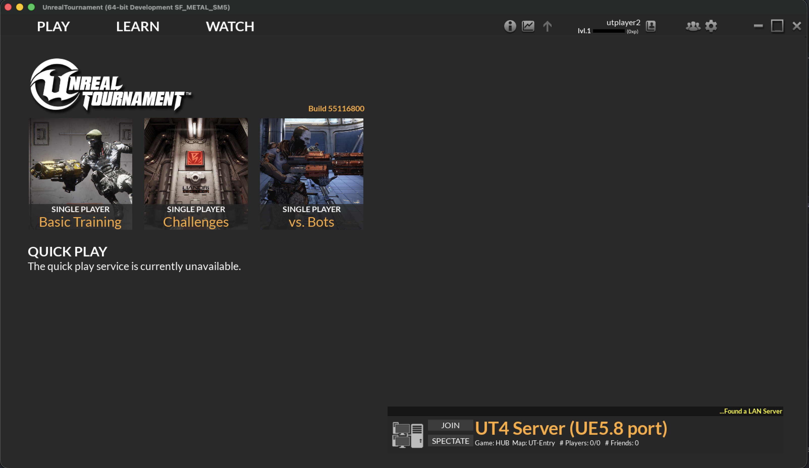
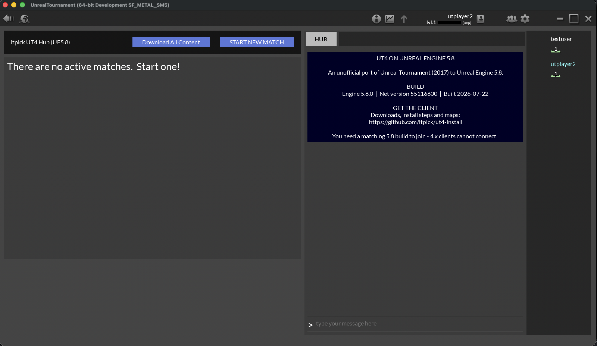
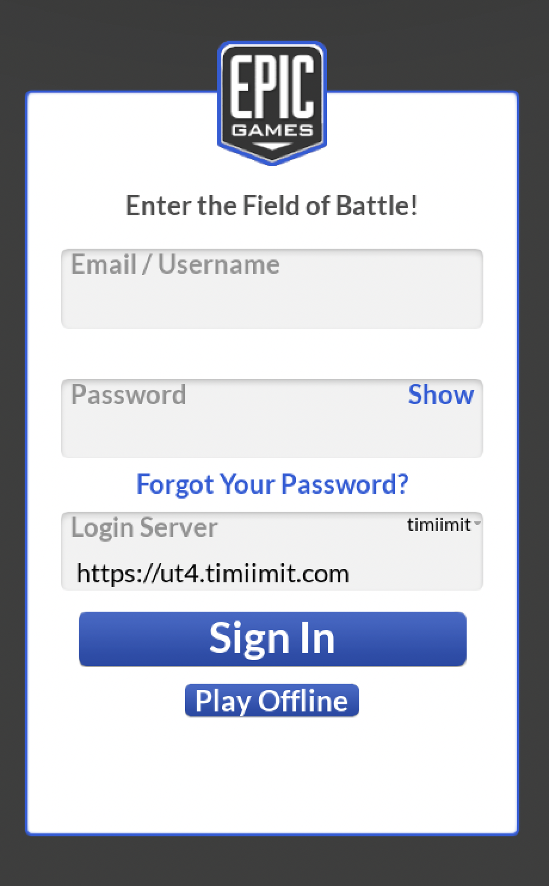

# UT4 on Unreal Engine 5.8 — install guide

Unofficial port of **Unreal Tournament (2017)** from Unreal Engine 4.15 to **Unreal Engine 5.8**.

| | |
|---|---|
| Engine | Unreal Engine 5.8.0 |
| Build | `55116800` |
| Built | 2026-07-26 |
| Platforms | Linux ✅ · macOS ✅ · Windows ✅ — see **Current status** below |

---

## 📊 Current status

What actually works from a **binary install** right now — updated as builds ship. Found something? [Open an issue](https://github.com/itpick/ut4-install/issues).

### Clients

| Platform | One-line install | Status | Notes |
|---|---|---|---|
| **Linux** | `curl -fsSL https://itpick.github.io/ut4-install/install.sh \| bash` | ✅ Working | Installs, launches, renders, signs in. |
| **macOS** (Universal) | `curl -fsSL https://itpick.github.io/ut4-install/install.command \| bash` | ✅ Working | Universal (Intel + Apple Silicon); renders + auto-login verified. Release re-uploaded and **verified** (download-back + `zstd -t`); the installer also self-heals corrupt/partial downloads (content-addressed block integrity) + fetches client parts **and** map paks in parallel. |
| **Windows** (Win64) | `irm https://itpick.github.io/ut4-install/install.ps1 \| iex` | ✅ Working | Full rebuild shipped (verified-good `bpHW_WeaponBar`); the corrupt-cook crash — [#24](https://github.com/itpick/ut4-install/issues/24) — is fixed. The old release archive was made from an incomplete cook (~2.5 GB vs the correct ~7 GB); re-run the installer to pull the fixed build. |

### Test maps / modes

Current playtest state of the stock content. **✅** good · **🟡** playable with issues · **❌** broken.

| Map(s) | Mode | Status | Notes |
|---|---|---|---|
| DM-Chill · DM-Outpost23 · DM-BioTower | Deathmatch | ✅ | Verified: HUD, bots, weapons, pickups. |
| CTF-Face · CTF-TitanPass | CTF | ✅ | Verified: flags, teams, scoring. |
| FR-Fort | Blitz (FlagRun) | ✅ | Verified end-to-end. |
| FR-MeltDown | Blitz (FlagRun) | 🟡 | Glass + floors corrected; bots die when the 15s countdown ends — [#20](https://github.com/itpick/ut4-install/issues/20). |
| (one CTF-style map) | CTF | 🟡 | Bots ride jump pads instead of grabbing the flag — map navmesh, [#21](https://github.com/itpick/ut4-install/issues/21). |
| Siege maps | Siege | ❌ | No bots/monsters spawn — [#18](https://github.com/itpick/ut4-install/issues/18); monster textures missing — [#19](https://github.com/itpick/ut4-install/issues/19). |
| TUT-* (Basic Training) | Training | 🟡 | "Lighting needs to be rebuilt" — [#15](https://github.com/itpick/ut4-install/issues/15). Windows crash — [#24](https://github.com/itpick/ut4-install/issues/24) — **fixed** in the current Win64 build. |

### Known bugs & fix status

**🟢 Ships next build** — fix merged & compile-verified, just needs the next binary · **🟠 Fix pending verification** — code fix written, not yet confirmed · **🔧 In progress** — actively being fixed · **🔴 Open** — no fix yet (needs investigation / map / content).

| Bug | Area | Fix status |
|---|---|---|
| Weapon auto-switch broken — empty-ammo, ammo-pickup, `:loaded` gives wrong weapon — [#16](https://github.com/itpick/ut4-install/issues/16) | Weapons | 🟢 Ships next build (merged `6a11dc0`, compiles clean) |
| FlagRun crash — Redeemer explosion at flag capture — [#17](https://github.com/itpick/ut4-install/issues/17) | Blitz | 🟢 Ships next build (null-guards merged, compiles clean) |
| Siege — no bots/monsters spawn — [#18](https://github.com/itpick/ut4-install/issues/18) | Siege | 🟢 Ships next build (cook fix merged; needs a recook) |
| Team-switch crash — modulo div-by-zero in `ServerSwitchTeam` — [#30](https://github.com/itpick/ut4-install/issues/30) | Team modes | 🟢 Ships next build (fix `56a7701`, built + playtested) |
| Loot-crate / chest screen null-deref crash — [#28](https://github.com/itpick/ut4-install/issues/28) | UI | 🟢 Ships next build (fix `3a9d26e`, built + playtested) |
| Client hardening — GameViewport null-guards · resilient CVar lookup · minimap perf — [#27](https://github.com/itpick/ut4-install/issues/27) · [#26](https://github.com/itpick/ut4-install/issues/26) · [#29](https://github.com/itpick/ut4-install/issues/29) | Client | 🟢 Ships next build (`ca30ad5`/`eea5309`/`1a3a352`, built + playtested) |
| Windows Basic Training crash — corrupt `bpHW_WeaponBar` — [#24](https://github.com/itpick/ut4-install/issues/24) | Windows / cook | 🟢 Fixed — full Win64 rebuild shipped (verified-good asset; old archive was an incomplete cook) |
| FR-MeltDown — bots die after the countdown — [#20](https://github.com/itpick/ut4-install/issues/20) | Map | 🔴 Open — editor pass on spawns / kill volumes |
| Bots ignore flag, ride jump pads — [#21](https://github.com/itpick/ut4-install/issues/21) | Map | 🔴 Open — map navmesh rebuild |
| Siege monster textures missing — [#19](https://github.com/itpick/ut4-install/issues/19) | Content | 🔴 Open — per-asset triage |
| Blitz doesn't filter energy packs — [#22](https://github.com/itpick/ut4-install/issues/22) | Blitz | 🔴 Open — needs editor repro |
| Training "lighting needs rebuilt" — [#15](https://github.com/itpick/ut4-install/issues/15) | Content | 🔴 Open — GPU Lightmass rebake |

---

## ▶ Easiest install — one click, auto-detects your OS

**→ [itpick.github.io/ut4-install](https://itpick.github.io/ut4-install/)**

Open that page and press the big download button — it detects your OS and hands you a
one-click installer that downloads the game **and the full ~40-map set**, verifies it,
unpacks it (and on macOS re-signs it correctly so mouse-look works), then launches it.
No `oras`, no Docker, no command line.

**On macOS and Windows, the one-liner below is the recommended path** — piping the
installer straight into a shell downloads nothing to disk, so it never trips macOS
Gatekeeper or Windows SmartScreen. Paste one line:

```bash
# macOS  (recommended — avoids Gatekeeper)
curl -fsSL https://itpick.github.io/ut4-install/install.command | bash
# Linux
curl -fsSL https://itpick.github.io/ut4-install/install.sh | bash
```
```powershell
# Windows (PowerShell) — recommended, avoids SmartScreen
irm https://itpick.github.io/ut4-install/install.ps1 | iex
```

> **macOS Gatekeeper note.** If you download the `install.command` *file* instead of using
> the one-liner, macOS will block it (*"Apple could not verify… Not Opened"*) — the build is
> signed ad-hoc, without a paid Apple notarization. Use the one-liner above, or approve the
> downloaded file: **right-click → Open**, or **System Settings → Privacy & Security → Open
> Anyway**, or first run `xattr -d com.apple.quarantine install.command`.
>
> **Windows** behaves the same for a downloaded `install.ps1` (SmartScreen / execution
> policy): prefer the one-liner, or run the file with
> `powershell -ExecutionPolicy Bypass -File install.ps1` and choose *More info → Run anyway*.

The installer pulls every stock map by default so you have the full set offline; add
`--no-maps` (bash) / `-NoMaps` (PowerShell) to skip them. Everything below is the
**manual / advanced** route.

### Release channels — stable (default) vs nightly

The installer pins to the **stable** channel by default: builds that have been tested and
promoted. To ride the latest **nightly** dev build instead (newer fixes, may be unstable):

```bash
# macOS / Linux
curl -fsSL https://itpick.github.io/ut4-install/install.command | bash -s -- --nightly
curl -fsSL https://itpick.github.io/ut4-install/install.sh      | bash -s -- --nightly
```
```powershell
# Windows
& ([scriptblock]::Create((irm https://itpick.github.io/ut4-install/install.ps1))) -Nightly
```

Or set `UT_CHANNEL=nightly` in the environment. Re-running the installer on the other
channel switches you over in place (incremental — only changed files download). Both
channels share one content-addressed block store, so switching is cheap. Maintainers
promote a tested nightly with `scripts/promote-to-stable.sh <mac|linux|win64>`.

### Download speed — parallelism + optional self-hosted mirror

All three installers already download in parallel: split client-archive parts, content-
addressed store blocks, and the ~40 map paks (`UT_MAP_PAR`, default 6 concurrent) all fetch
concurrently, with per-file resume + integrity verification (see [#23](https://github.com/itpick/ut4-install/issues/23)).

For the other half of #23 — self-hosting the main download with GitHub as a backup — every
installer and sync script supports an optional mirror, off by default:

```bash
# macOS / Linux
UT_MIRROR_BASE=https://mirror.example.com curl -fsSL https://itpick.github.io/ut4-install/install.sh | bash
```
```powershell
# Windows
$env:UT_MIRROR_BASE = "https://mirror.example.com"
irm https://itpick.github.io/ut4-install/install.ps1 | iex
```

When set, every download (client-archive parts, the manifest, and every content-addressed
store block) tries `$UT_MIRROR_BASE/<release-tag>/<asset>` first and falls back to GitHub
per-file if the mirror doesn't have it or isn't reachable — so a partially-seeded or
temporarily-down mirror degrades to plain GitHub instead of failing outright. Leave it unset
(the default) and behavior is unchanged. A mirror just needs to serve the identical path
layout as GitHub Releases (`<tag>/<asset>`) — e.g. an object-storage bucket + CDN kept in sync
with the GitHub releases via `rclone`/`rsync`, fronting the highest-volume assets (the block
store and the latest client archive). Standing up that mirror is an infra/ops task, not an
installer change — this wiring is ready for whenever one exists.

---

Client builds are published as OCI artifacts on **GitHub Container Registry** (no per-file
size limit), and individual maps are published as downloadable paks on the
[Releases](https://github.com/itpick/ut4-install/releases) page. Source lives in
[itpick/UnrealTournament](https://github.com/itpick/UnrealTournament/tree/main) on the `main`
branch; the engine fork is [itpick/UnrealEngine](https://github.com/itpick/UnrealEngine).

> 🐛 **Found a bug, or want a feature?** Please **[open an issue](https://github.com/itpick/ut4-install/issues)**
> on this repo — bug reports and feature requests are welcome and are how things get fixed and prioritized.

📋 **What's changed since the UE4.15 port?** See the **[CHANGELOG](CHANGELOG.md)** — the bugs fixed and features added on the way to UE5.8.

---

## 🚀 Performance / FPS

Low frame rate? See the **[Performance & FPS guide](docs/PERFORMANCE.md)** — how to see your
FPS (`~` console → `stat unit`, or *Settings → System → Show Performance Stats*), how to get
more FPS on weaker GPUs, and GPU-driver guidance.

> A set of performance fixes is landing — notably **occlusion culling is being re-enabled on
> Windows/macOS** (it had been globally disabled by a Linux-only workaround, so the client was
> rendering everything behind walls). That's a large GPU win, especially on lower-end cards.

**Typical FPS by OS** *(placeholders — [help us fill these in](docs/PERFORMANCE.md#report-your-numbers))*:

| OS | Typical FPS | Notes |
|----|-------------|-------|
| **Windows** (Win64) | _TBD_ | D3D12 — keep GPU drivers current (this is UE5.8, not old UT4). |
| **macOS** (Universal) | _TBD_ | Metal; scales with graphics settings. |
| **Linux** | _TBD_ | Vulkan; use `-onethread` if startup hangs. |

Hit a low frame rate? Use the in-game **"Report a Bug"** button — it sends your GPU/CPU/RAM +
settings so we can tune for your hardware.

❤️ **Enjoying it? Help keep it alive.** This is a free, community-run project — the servers, build machines, and development all cost real money. If you'd like to chip in, **[support it on Patreon](https://patreon.com/itpick)**. No paywall, ever — donations just keep the lights on.

---

## Screenshots

| Main menu | Hub |
|---|---|
|  |  |

<p align="center"></p>

---

# Advanced / manual install

> Most people should use the **[one-click installer](https://itpick.github.io/ut4-install/)**
> above. Everything from here down is the manual route — pulling the client with `oras`,
> hosting downloadable maps, and running your own server or hub.

🛠️ **Making maps or mods?** See **[EDITOR.md](EDITOR.md)** — how to build the **UT4 (UE5.8)
Editor** from source on macOS, Linux and Windows (and the plan for pre-built editor
packages). The editor is only needed to open/edit content; to just play, use the installer above.

## Downloads

| Artifact | Download size | Location |
|---|---|---|
| Linux client | 8.6 GB (≈16 GB extracted) | [`ghcr.io/itpick/ut4-install:linux-5.8`](https://github.com/users/itpick/packages/container/package/ut4-install) |
| macOS client (Universal — Intel + Apple Silicon) | 14 GB (≈16 GB extracted) | [`ghcr.io/itpick/ut4-install:mac-5.8`](https://github.com/users/itpick/packages/container/package/ut4-install) |
| Windows client (Win64) | ~7.7 GB (≈10 GB extracted) | [`ghcr.io/itpick/ut4-install:win64-5.8`](https://github.com/users/itpick/packages/container/package/ut4-install) |
| Dedicated server / hub (Linux) | ~2 GB | [`ghcr.io/itpick/ut4-install:server-linux-5.8`](https://github.com/users/itpick/packages/container/package/ut4-install) |
| Per-map paks (Linux) | ~2.3 GB total (40 maps) | [Release `maps-linux-v1`](https://github.com/itpick/ut4-install/releases/tag/maps-linux-v1) |
| Per-map paks (macOS) | ~2 GB total (40 maps) | [Release `maps-mac-v1`](https://github.com/itpick/ut4-install/releases/tag/maps-mac-v1) |
| Per-map paks (Windows) | ~2.4 GB total (40 maps) | [Release `maps-win-v1`](https://github.com/itpick/ut4-install/releases/tag/maps-win-v1) |

The **dedicated server / hub** package is a single Linux server build; whether it runs as a
lobby **hub** or a single **dedicated match** is just the launch command (see below).

The client artifacts are pulled with [`oras`](https://oras.land) (a small CLI for OCI
registries). Each is a single zstd-compressed tarball of the staged build.

```bash
# one-time: install oras — https://oras.land/docs/installation
oras pull ghcr.io/itpick/ut4-install:linux-5.8      # or :mac-5.8
```

### Editor (for mappers)

Want to make **maps or mods**? You'll need the UT4 (UE5.8) **Editor** (not needed just to play).

| Editor | Status | Get it |
|---|---|---|
| macOS editor   | Build from source now · pre-built package in progress | [EDITOR.md](EDITOR.md) · `editor-mac-5.8` |
| Linux editor   | Build from source now · pre-built package in progress | [EDITOR.md](EDITOR.md) · `editor-linux-5.8` |
| Windows editor | Build from source now · pre-built package in progress | [EDITOR.md](EDITOR.md) · `editor-win64-5.8` |

- **Today — build from source:** follow **[EDITOR.md](EDITOR.md)** (macOS / Linux / Windows). Needs ~200 GB disk and a long first build, but it's always current.
- **Coming — pre-built packages** (~30–42 GB each, plug-and-play): published to `ghcr.io/itpick/ut4-install:editor-<plat>-5.8` and split to `editor-<plat>-5.8` Releases. The direct download links will appear in the table above once they're built.

---

## Important: you cannot mix versions

A UE5.8 client can only join a UE5.8 server, and a 4.x client can only join a 4.x server.
The engine network protocol and map serialization both changed, so the two populations are
mutually unreachable by design — servers advertise their network version and clients filter
on it.

Maps are also **cooked per platform**. The lighting bake is shared, but Linux, macOS and
Windows each need their own pak set. A single universal map pak is not possible — this is
why the map release is platform-tagged (`-LinuxNoEditor.pak`).

---

## Requirements

- A 64-bit machine with a GPU supporting **Vulkan** (Linux), **Metal** (macOS) or **D3D12** (Windows)
- ~16 GB free disk for the client
- `oras` on your PATH to download the client
- An account on the master server you intend to play on

---

## Linux

```bash
oras pull ghcr.io/itpick/ut4-install:linux-5.8
tar -I zstd -xf ut4-client-linux.tar.zst
cd LinuxNoEditor
./UnrealTournament.sh
```

If you get a black screen or a hang on startup, try forcing single-threaded rendering:

```bash
./UnrealTournament.sh -onethread
```

Some Mesa/RADV driver combinations deadlock in the Vulkan RHI without it.

---

## macOS (Universal — Intel & Apple Silicon)

The macOS client is a **Universal binary** (`arm64 + x86_64`) — the same download runs
natively on both Apple Silicon and Intel Macs.

```bash
oras pull ghcr.io/itpick/ut4-install:mac-5.8
tar -I zstd -xf ut4-client-mac.tar.zst
xattr -dr com.apple.quarantine UnrealTournament.app   # clears the download quarantine
open UnrealTournament.app
```

### Grant Local Network access — required for LAN play

From **macOS 15 onward**, macOS blocks apps from reaching other machines on your network
until you approve it. On first launch you should get a prompt; approve it.

If you miss the prompt, enable it manually:

**System Settings → Privacy & Security → Local Network → Unreal Tournament**

Without this permission the symptoms are confusing rather than obvious:

- Login to a master server on your LAN fails instantly with *"The Internet connection appears to be offline"*
- Servers appear in the browser but never respond to pings, so hubs look empty
- Joining a game silently times out

A master server reached over the public internet works without it; only LAN addresses are gated.

> **Launch it with `open`, not by running the binary directly.** A direct launch bypasses the
> app sandbox and its entitlements, which breaks networking and login.

### Troubleshooting

**Mouse won't turn the view — you can move (WASD) and fire, but the camera won't rotate.**

This is the macOS **app sandbox** revoking the game's mouse capture. Movement, firing, and
menus all keep working — only continuous mouse-look dies — which makes it look like an input
or menu bug when it isn't. In the client log you'll see the viewport capture mode repeatedly
flip to `NoCapture` (`LogViewport: Display: Viewport MouseCaptureMode Changed, ... -> NoCapture`).
A client signed with `com.apple.security.app-sandbox` cannot hold the permanent cursor capture
that UE needs to feed continuous mouse-look.

**Fix:** the macOS client must be signed **without** the app sandbox. Make sure you're on a
`mac-5.8` build published **2026-07-25 or later** (earlier builds were sandboxed and have this
bug). To check any build:

```bash
codesign -d --entitlements - UnrealTournament.app | grep app-sandbox   # must print nothing
```

If it prints `[Key] com.apple.security.app-sandbox`, that build is affected. Networking, LAN
discovery, and sign-in all work fine on an unsandboxed build — the sandbox is not required for
them, and removing it is what makes mouse-look work.

> **Maintainer note:** sign/ship the client unsandboxed (`codesign --force --deep --sign - --identifier com.itpick.UnrealTournament58 UnrealTournament.app`, no `--entitlements`, or an entitlements file that does **not** contain `app-sandbox`). Do **not** re-add the sandbox to "fix networking" — that reintroduces the dead-mouse-look bug.

---

## Windows (Win64)

```powershell
oras pull ghcr.io/itpick/ut4-install:win64-5.8
tar --zstd -xf ut4-client-win64.tar.zst   # bsdtar (Win10/11) supports --zstd; or use 7-Zip
.\UnrealTournament\Binaries\Win64\UnrealTournament-Win64-Shipping.exe
```

> **If the game won't start (missing VC++ redist):** the one-click installer installs the
> Visual C++ x64 runtime for you (bundled `UEPrereqSetup_x64.exe`, or Microsoft's
> [`vc_redist.x64.exe`](https://aka.ms/vs/17/release/vc_redist.x64.exe)). Doing it manually,
> the **top-level `UnrealTournament.exe` is UE's launcher/prereq stub** — if it errors asking
> for the "VC++ redist 2018-2022", install the
> [VC++ x64 redistributable](https://aka.ms/vs/17/release/vc_redist.x64.exe) and run the real
> game exe under **`UnrealTournament\Binaries\Win64\`** (e.g. `UnrealTournament-Win64-Shipping.exe`).

Requires a **D3D11/D3D12-capable GPU** (a headless/GPU-less VM will exit with *"a D3D11-compatible
GPU is required"*). The client is a single legacy pak (`bUseIoStore=False`), same as Linux/macOS,
so it joins the same UE5.8 hubs and downloads the same map redirects.

---

## Downloadable maps

The client ships with the full stock map set baked in, so you do not need to download
anything to play the standard rotation. Hubs can also advertise **extra** maps the client
does not have; when you join, the client fetches the map's pak over HTTPS, verifies its MD5,
mounts it and loads in — no manual install.

The per-map paks are hosted on the [`maps-linux-v1`](https://github.com/itpick/ut4-install/releases/tag/maps-linux-v1),
[`maps-mac-v1`](https://github.com/itpick/ut4-install/releases/tag/maps-mac-v1) and
[`maps-win-v1`](https://github.com/itpick/ut4-install/releases/tag/maps-win-v1) releases
(one per platform). To advertise one from your own hub, add a redirect (the MD5 is the
release asset's checksum):

```ini
[OnlineSubsystemUT]
+RedirectReferences=(PackageName="DM-Chill",PackageURLProtocol="https",PackageURL="https://github.com/itpick/ut4-install/releases/download/maps-linux-v1/DM-Chill-LinuxNoEditor.pak",PackageChecksum="<md5>")
```

Because paks are per platform, a mixed Linux/macOS lobby needs both a `-LinuxNoEditor.pak`
and a `-MacNoEditor.pak` redirect for any downloadable map; each client picks the one for
its platform.

---

## Signing in

The game needs a master server for login and the server browser.

1. Launch the game
2. On the login screen, set **Login Server** to the master server URL, e.g. `https://ut4.example.com`
3. Enter your username and password, then **Sign In**

**Play Offline** skips login entirely and works for single-player and bot matches.

---

## Joining a game

**Hubs** host multiple matches; you join the hub, then join or start a match inside it.
**Servers** are a single ongoing match you join directly.

`PLAY → Join a Hub` lists both, split across the **Hubs** and **Servers** tabs. Empty hubs
are shown, but a server only appears once it answers a ping — if the list is empty, the
servers either are not running or are unreachable from your network.

You can also connect directly from the console:

```
open <address>:7777
```

---

## Running your own server or hub

Download the server package (same build serves both roles):

```bash
oras pull ghcr.io/itpick/ut4-install:server-linux-5.8
tar -I zstd -xf ut4-server-linux.tar.zst
cd LinuxServer
```

```bash
# Hub — hosts a lobby and spawns match instances on demand (game 7777, query 7787)
./UnrealTournament/Binaries/Linux/UnrealTournamentServer "UT-Entry?Game=LOBBY" \
  -log -port=7777

# Single dedicated match — use a different port pair so it can run alongside a hub
./UnrealTournament/Binaries/Linux/UnrealTournamentServer "DM-Outpost23?Game=DM?BotFill=6" \
  -log -port=7900 -BeaconPort=7901
```

A hub owns one query beacon, so run a dedicated match on its own `-port`/`-BeaconPort`
pair (e.g. `7900`/`7901`) rather than sharing the hub's `7777`/`7787`.

### Ports to open (UDP)

| Port | Purpose |
|---|---|
| `7777` | game traffic |
| `7787` | query beacon — **required**, a hub with this closed is invisible in the browser |
| `8000`–`8150` | match instances a hub spawns (`StartingInstancePort` + `InstancePortStep` × `MaxInstances`) |

Port `14000` is the hub↔instance channel and stays on loopback — do **not** expose it.

If your server shares a host with the master server, it may register the wrong address
(a container bridge IP rather than its real one). Set the address it should advertise:

```ini
[OnlineSubsystemUT]
ServerAddressOverride=203.0.113.10
```

Or on the command line for an existing packaged build:

```
-ini:Engine:[OnlineSubsystemUT]:ServerAddressOverride=203.0.113.10
```

---

## Known issues

- **Quick Play** — no quickplay hubs are running by default, but they can be launched, so this isn't really a defect, just an unconfigured feature
- **Remember-me / auto-login** is not implemented; you sign in each launch
- Player stats and MMR are unavailable (`McpUtils` is an Epic service)

---

## Support the project

Everything here — the game, the servers, the builds — is **free and always will be**. But keeping community multiplayer alive costs real money every month: always-on servers, build hardware, electricity, and development. If you'd like to help cover it:

- **Patreon:** [patreon.com/itpick](https://patreon.com/itpick)

Chip in monthly or drop a one-time tip — it all goes straight to keeping the servers online and the builds shipping. Thank you. ❤️

## Mods & community content

Popular UT4 community mods are being ported to UE5.8. **None are finished yet** — this table is updated as each lands:

| Mod | What it is | Status |
|---|---|---|
| [NetcodePlus](https://github.com/jmortley/NetcodePlusUT4) ([UE5.8 fork](https://github.com/itpick/NetcodePlusUT4/tree/ue5.8-port)) | Improved netcode (hit-reg, prediction, lag comp) + community game modes (ElimPlus, NCLeague, Wipeout…) | 🔨 Compiles on UE5.8 — gameplay testing next |
| Domination (+ MultiTeam) | The classic Domination game mode | 🔨 In progress |
| ShockFix | Shock-rifle hit-registration fix | 📋 Planned |
| Betrayal | Betrayal game mode | 📋 Planned |
| StatSQL | Match-stats backend | 📋 Planned |
| UTVehicles | Vehicles | 📋 Planned (large) |

Ports are done from the mod authors' open source and, where it makes sense, contributed back upstream.

**Community maps:** the full stock map set (DM, CTF, and FlagRun/Blitz) ships baked into the client. Custom community maps that survive only as cooked UE4.15 paks **can't be rebuilt for UE5.8** without the original mappers' uncooked source — we're cataloguing them and reaching out to authors.

## Credits

Unreal Tournament and Unreal Engine are trademarks of Epic Games, Inc. This is a
community port of Epic's open-sourced UT4 code, unaffiliated with and unendorsed by Epic.

Master server: [timiimit/UT4MasterServer](https://github.com/timiimit/UT4MasterServer).
